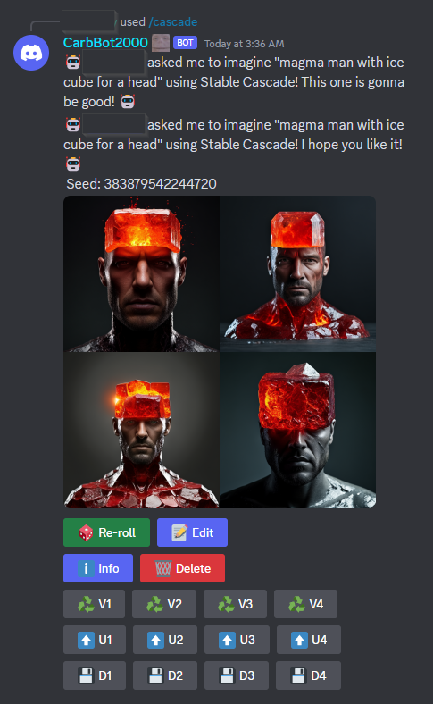
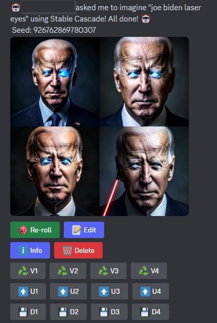
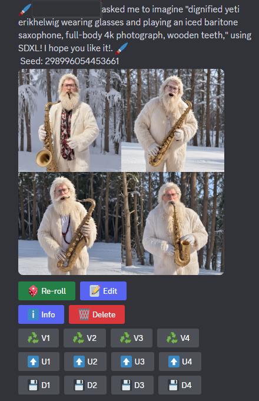

# ComfyPipe

<p float="left" align="center">
  
   
  
</p>

**ComfyPipe** makes your weirdest fantasies come true~~

## Features

* Uses ComfyUI and ComfyScript to generate images!
* Works across many Discord servers and in DMs
* SDXL, Stable Cascade, and SD1.5
* LoRAs
* GIF Generation through AnimateDiff
* Aspect ratios!
* img2img, inpainting, image mashups (through Stable Cascade)
* Music generation!

## Installation

Ensure python 3.10 exactly is installed on your system. Also ensure that git is installed. If you wish to use a separately hosted ComfyUI instance, please follow the manual instructions.

### Before Installation

Create your Discord app by going to the [Discord Developer Portal](https://discord.com/developers). Create a new application and bot. Copy the token and put it in the `config.properties` file.
You will also need to invite the bot to your server. You can do this by going to the OAuth2 tab and selecting the bot scope. Then select the permissions you want the bot to have.
Copy the link and paste it into your browser. Select the server you want to invite the bot to and click authorize.

### Automatic

#### Linux

```
git clone https://github.com/ambocclusion/ComfyUI-SDXL-DiscordBot.git
cd ComfyUI-SDXL-DiscordBot
chmod +x setup.sh
./setup.sh
```

This will create a venv and install ComfyUI in the `embedded_comfy` directory. Put your key in the config.properties file. Please follow the [After Installation](#after-installation) instructions
after completion.

#### Windows

Open a command prompt or Powershell and run the following commands:

```
git clone https://github.com/ambocclusion/ComfyUI-SDXL-DiscordBot.git
cd ComfyUI-SDXL-DiscordBot
./setup.bat
```

#### After Installation

Please put all of your checkpoints in `embedded_comfy/models/checkpoints/<sdversion>` directory. Install any required custom nodes and put any LoRAs in `embedded_comfy/models/loras` directory.
In order for upscaling to work you will need to download an upscaler model like [RealESRGAN_x4plus](https://github.com/xinntao/Real-ESRGAN/releases/download/v0.1.0/RealESRGAN_x4plus.pth) and place it
in the `embedded_comfy/models/upscale_models` directory.

##### Links to models

* [SDXL](https://huggingface.co/stabilityai/stable-diffusion-xl-base-1.0/blob/main/sd_xl_base_1.0.safetensors)
* [SD 1.5](https://huggingface.co/runwayml/stable-diffusion-v1-5/blob/main/v1-5-pruned-emaonly.safetensors)
* [Stable Cascade](https://huggingface.co/stabilityai/stable-cascade/tree/main/comfyui_checkpoints)

This bot is also compatible with other models found on HuggingFace and Civit.ai.

### Manual

#### ComfyUI Dependencies

* [ComfyUI](https://github.com/comfyanonymous/ComfyUI)
* [ComfyScript](https://github.com/Chaoses-Ib/ComfyScript)
* [ComfyUI_Ib_CustomNodes](https://github.com/Chaoses-Ib/ComfyUI_Ib_CustomNodes)
* [was-node-suite](https://github.com/WASasquatch/was-node-suite-comfyui)
* [ComfyUI_Comfyroll_CustomNodes](https://github.com/Suzie1/ComfyUI_Comfyroll_CustomNodes)
* [ComfyUI-AnimateDiff-Evolved](https://github.com/Kosinkadink/ComfyUI-AnimateDiff-Evolved)
* [ComfyUI-VideoHelperSuite](https://github.com/Kosinkadink/ComfyUI-VideoHelperSuite)
* (Linux only) [ComfyUI-audio](https://github.com/eigenpunk/ComfyUI-audio)

#### Instructions

Install [ComfyUI](https://github.com/comfyanonymous/ComfyUI) and ensure the `--listen` flag is set during launch. Install each of the above nodes in the `custom_nodes` folder. In a folder separate
from ComfyUI run the following commands in a terminal or CLI:

```
git clone https://github.com/ambocclusion/ComfyUI-SDXL-DiscordBot.git
cd ComfyUI-SDXL-DiscordBot
pip install -r requirements.txt
```

Copy or rename the config.properties.example file to config.properties and set your Discord bot token in [BOT] -> TOKEN. Ensure the [LOCAL] -> SERVER_ADDRESS is set to an address that
includes `http://` or `https://`.

ComfyPipe should detect models and loras in your models directory. To make sure the models show up in the correct commands, make sure your models are put in the following structure:

```
- ComfyUIRoot
    - models
        - checkpoints
            - 15
            - sdxl
            - cascade
        - loras
            - 15
            - sdxl
            - cascade
        - upscale_models
```

Launch the bot with `python __main__.py`.

### Future Plans

* LLM to enhance prompts and talk with the responses
* Customize which commands you'd like to use
* Better UI for interactions
* Model and lora editing in the Edit modal

<div align="center">

[Support the original creator](https://ko-fi.com/dab_bot)

</div>
